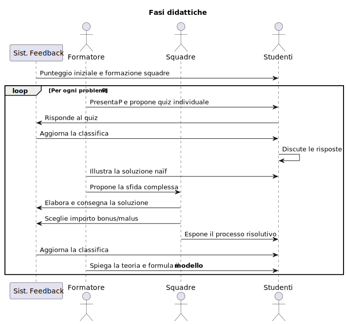
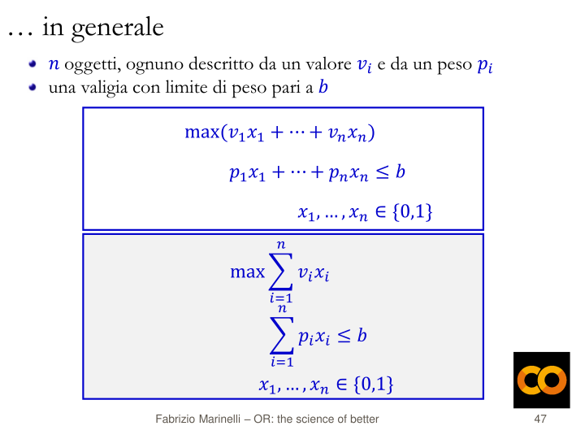

<Frontespizio />

<!--
Buongiorno, sono Gionata Massi e presento l'esperienza didattica "Il Modello tra Problema e Soluzione: Un Percorso tra Competizione e Consapevolezza". Sebbene sia io qui ad illustrare il percorso didattico e la metodologia, questi sono opera del prof. Fabrizio Marinelli, che ho avuto il piacere di coinvolgere in una collaborazione tra l'IIS Savoia Benincasa, scuola in cui insegno, e l'Università Politecnica delle Marche.
Come espresso nel titolo, l'esperienza ha voluto evidenziare il ruolo dell **modello**, un concetto fondamentale per l'informatica che viene spesso trascurato per lasciare spazio all'algoritmo inteso come mera sequenza di azioni. Il sottotitolo vuole indicare come la metodologia utilizzata  si è avvalsa delle tecniche della **gamification**, per favorire il coinvolgimento, e sulla riflessione sul processo cognitivo, per rendere significativa e persistente l'acquisizione delle competenze.
-->

---
layout: itadinfo
---

# Piano della Presentazione

<Toc text-sm minDepth="1" maxDepth="2" />

<!--
Vederemo in quale contesto, con quali risorse e quali vincoli, è stata sviluppata l'esperienza didattica; fisseremo gli obiettivi didattici trasversali e specifici; discuteremo della particolare metodologia didattica messa in atto, basata su problemi da risolvere in modo da catturare l'attenzione e stimolare la riflessione; vedremo quali sono i problemi che sono stati presentati, che potere riconoscere tra alcuni classici problemi decisionali; e concluderemo con un'analisi dei risultati ottenuti e dei possibili sviluppi.
-->

---
layout: itadinfo
---

# Contesto

- DM 65/2025
   - Potenziamento delle competenze STEM
   - Linee Guida per le discipline STEM
      - *Utilizzare metodologie attive e collaborative*
      - *Promuovere attività che affrontino questioni e problemi di natura applicativa.*
      - Utilizzare metodologie didattiche per un apprendimento di tipo induttivo.

> [...] promuovere l’integrazione, all’interno dei curricula di tutti i cicli scolastici, di attività, metodologie e contenuti volti a sviluppare le competenze STEM, digitali e di innovazione [...]
>
> **DM n. 65 del 12 aprile 2023**...

- IIS Savoia Benincasa, Ancona
   - IT *Economico*, AFM art. *Sistemi Informativi Aziendali*, Classe *V*
- Università Politecnica delle Marche
   - Prof. Fabrizio Marinelli

<!-- Il percorso didattico è nato quando l'IIS Savoia Benincasa, scuola in cui insegno informatica nell'Istituto Tecnico Economico, ha ricevuto il finanziamento dal DM 65/2025 sul potenziamento delle competenze STEM, Science, Tecnology, Engineering and Mathematics. Mi sono trovato coinvonto nella progettazione e, sebbene nell'acronimo STEM non compaiano esplicitamente la Computer Science/Informatics, ho cercato un modo per recuperare la nostra disciplina in un'ottica d'integrazione con le altre discipline.

C'era da progettare un corso con vincoli disciplinari ma anche metodologici, come definito dalle Linee Guida per le discipline STEM. Esse richiedono di *Utilizzare metodologie attive e collaborative* e di *Promuovere attività che affrontino questioni e problemi di natura applicativa.*.

Per inciso e con piacere, faccio notare che le linee guida citano le *Indicazioni Nazionali per l'insegnamento dell’Informatica nella Scuola* proposte dal CINI nel 2017.

La scelta del "gruppo target", presa in collaborazione con i vari dipartimenti della scuola, è stata quella della classe V dell'IT Economico indirizzo AFM art. Sistemi Informativi Aziendali. Le materie oggetto della seconda prova dell'Esame di Stato per questa articolazione avrebbero potuto essere Economia Aziendale oppure Informatica, e al colloquio probabilmente avrebbero avuto un commissario di Matematica interessato alla Ricerca Operativa. Gli insegnanti di matematica degli Istituti Tecnici sono infatti inquadrati nella Classe di Concorso "Scienze matematiche applicate". -->

---
layout: itadinfo
---

# Obiettivi

- Trasversali
   - Integrare le competenze in Informatica con quelle di Matematica ed Economia
   - Motivare lo studio verso le discipline STEM
   - Promuovere attività che affrontino problemi e questioni di natura applicativa
- Disciplinari
   - Astrarre le caratteristiche comuni di un problema decisionale
   - Descrivere formalmente un problema decisionale
   - Scoprire come algoritmi diversi risolvono, con uso diverso delle risorse di calcolo, lo stesso problema
   - Scoprire metodi euristici e/o algoritmi esatti per risolvere problemi
   - Definire lo spazio delle soluzioni
   - Valutare l'efficienza degli algoritmi in termini di tempo di calcolo

<!-- Sugli obiettivi specifici ci si è orientati nell'intersezione delle competenze tra Matematica applicata, che coinvolge tutte le lettere di STEM, e l'Informatica, cercando anche un legame con il mondo dell'Economia nella scelta dei contenuti. -->

---
layout: itadinfo
---

# Metodologia didattica

Una sintesi di:

- *Lezione segmentata*
- *Problem-Based Learning* 
- *Gamification*
- Attenzione ai processi metacognitivi

sviluppata sui problemi decisionali.

<!-- La proposta metodologica integra elementi ed idee provenienti da:
- *lezione segmentata*, per massimizzare efficacia didattica nel rispetto dei tempi attenzione degli studenti;
- *Problem-Based Learning*, adattattato alle scienze che hanno risposte oggettivamente
verificabili;
- *gamification*, per aumentare il coinvolgimento e la partecipazione attiva degli studenti, e infine,
- uno stimolo costante alla riflessione sul processo di apprendimento, *active recall*, realizzato sia con domande frequenti ed esposizioni rapide degli studenti, sia tramite un meccanismo di bonus e malus, chiamato impropriamente *scommessa*. -->

---
layout: default
---

## Regole del gioco

   {width=70%, title="Regole del gioco"}

<!-- Il corso diventa un *gioco serio*, in cui ogni partecipante ha una dotazione iniziale di 1000 *dobloni* e guadagna dobloni rispondendo correttamente a domande individuali. I partecipanti collaborano in squadra alla risoluzione di problemi e, insieme al proprio gruppo, possono *scommetterne* da 10 a 200 dobloni sulla qualità della propria soluzione, con la possibilità di incrementare o ridurre la propria
dotazione in base all'esito.

Per l'esperienza descritta, sono state formate quattro squadre di quattro studenti ciascuna, con composizione casuale e invariata per tutta la durata del corso.

Il sistema di feedback con i nomi degli studenti, i gruppi, il punteggio dei singoli e il punteggio della squadra, dato dal punteggio medio degli studenti, è stato realizzato con un foglio di calcolo condiviso. -->

---
hideInToc: true
layout: default
---

## Un gioco serio!

   {width=70%, title="Fasi didattiche"}

<!-- La progressione didattica, approssimativamente, è quella presentata nel diagramma, nel quale andrebbe inserito l'attore "Tutor" che aggiorna il sistema di feedback.

L'idea è quella di procedere per problemi, che possono ripetersi nel tipo, ad esempio il problema dello zaino che vedremo nel dettaglio.
Il problema necessita di una introduzione breve, che definisce i termini e i concetti di base. Segue immediatamente una verifica dei concetti appena esposti *esercizi attivi*, ad esempio quiz. Il sistema di feedback fornisce il meccanisco per *capire se ho capito* e una discussione aperta a tutta la classe per determinare le risposte corrette.
Arriva il momento di sintetizzare e viene presentata dal formatore la soluzione *naïf*.
Agli studenti dovrebbe risultare che ora sono in grado di risolvere problemi reali! Ma non sarà sempre così perché abbiamo problemi difficili, *ardui*, che richiedono strategie algoritmiche non banali.
Per farlo capire, il formatore propone una sfida complessa, ad esempio aumentando la dimensione dell'istanza del problema. 
Gli studenti lavorano in gruppo per un tempo di risoluzione di circa 25/30 minuti, trovano una soluzione e riflettono sulla bontà della loro proposta.
Al termine viene richiesto ad ogni gruppo di dire come hanno risolto il problema e come hanno valutato la loro soluzione.
La classifica viene aggiornata ma resta l'incognita dei conoscere quale sia la migliore soluzione possibile.
Qui interviene di nuovo il formatore per illustrare il modello e/o l'algoritmo, e poi il *risolutore* che ci fornisce la soluzione ottima.
-->

---
layout: itadinfo
---

## Successione dei problemi

- Problema dello zaino
- Problema del rettangolo isoperimetrico di area massima
- Problema dello zaino (seconda iterazione)
- Problema del mix ottimo di produzione
- Problema della dieta di costo minimo

<!-- Si presentano alcuni problemi. Ogni problema può essere affrontato con un livello di dettaglio diverso, con un approccio a SPIRALE, come vedremo nel caso del problema dello zaino.
I problemi sono classici problemi di decisione. -->
---
layout: default
---

## Fasi didattiche: il Problema dello Zaino

   {width=70%, title="Introduzione - Problema dello Zaino"}

---
layout: default
---

### Problema dello Zaino - Sfida individuale

   {width=70%, title="Sfida individuale - Problema dello Zaino"}

---
layout: default
---

### Problema dello Zaino - Soluzione naïf

   {width=70%, title="Soluzione naïf - 1 - Problema dello Zaino"}

---
layout: default
---

### Problema dello Zaino - Spazio delle soluzioni

   {width=70%, title="Soluzione naïf - 2 - Problema dello Zaino"}

---
layout: default
---

### Problema dello Zaino - Sfida di gruppo

   {width=70%, title="Sfida di gruppo - Problema dello Zaino"}

---
layout: default
---

### Problema dello Zaino - Discussione

   {width=70%, title="Discussione - Problema dello Zaino"}

---
layout: default
---

### Problema dello Zaino - Verso il modello

   {width=70%, title="Spiegazione - Problema dello Zaino"}

---
layout: default
---

### Problema dello Zaino - Il modello

   {width=70%, title="Spiegazione - Problema dello Zaino"}

---
layout: itadinfo
---

### Problema dello zaino - Concetti chiave

- Astrazione
- Rappresentazione
   - del problema -> MODELLO
   - codifica dell'istanza
   - codifica e spazio delle soluzioni
- Algoritmi
   - esatti (enumerazione totale)
   - euristici (greedy)
   - complessità temporale: crescita esponenziale
- Linguaggi
   - Programmazione Lineare Intera (PLI)
   - A Mathematical Programming Language (AMPL)

---
layout: itadinfo
---

# Conclusioni...

- Didattica disciplinare
   - Tutto quanto sopra!
   - Dal problema alla soluzione tramite la costruzione del Modello
   - Risoluzione di problemi reali
- Metodologia didattica
   - Attiva, efficace e motivante
   - Attivazione processi metacognitivi
- Estendibilità ad altri ambiti
   - programmazione
   - basi di dati
   - ingegneria del software

---
hideInToc: true
layout: itadinfo
---

# ...e sviluppi futuri

- Revisione delle tecniche di gamification e versione online del sistema di gamification
- Repliche del corso, anche in altri indirizzi, esteso a  problemi formulati su grafi
- Monitoraggio dell'efficacia didattica con raccolta di dati per analisi e miglioramenti

---
hideInToc: true
layout: default
---

<RetroFrontespizio />

---
layout: itadinfo
---

### Problema dello Zaino - Discussione - 2

   {width=70%, title="Discussione - Problema dello Zaino"}

---
layout: itadinfo
---

### Problema dello Zaino - Spiegazione e MODELLO - 1

   {width=70%, title="Spiegazione - Problema dello Zaino"}

---
layout: itadinfo
---

### Problema dello Zaino - Spiegazione e MODELLO - 3

   {width=70%, title="Spiegazione - Problema dello Zaino"}

---
layout: itadinfo
---

### Problema dello Zaino - Spiegazione e MODELLO - 4

   {width=70%, title="Spiegazione - Problema dello Zaino"}

---
layout: itadinfo
---

### Problema dello Zaino - Spiegazione e MODELLO - 5

   {width=70%, title="Spiegazione - Problema dello Zaino"}

---
layout: itadinfo
---

### Problema dello Zaino - Spiegazione e MODELLO - 6

   {width=70%, title="Spiegazione - Problema dello Zaino"}

---
layout: itadinfo
---

## Rettangolo isoperimetrico

   {width=70%, title="Introduzione - Rettangolo isoperimetrico"}

---
layout: itadinfo
---

### Rettangolo isoperimetrico - Concetti chiave

- Astrazione
- Rappresentazione
   - del problema -> MODELLO
   - discretizzazione spazio delle soluzioni
   - codifica dell'istanza discretizzata 
   - codifica delle soluzioni e simmetria
- Algoritmi
   - simulazione: iterazione con ricerca del massimo
   - soluzione algebrica (cond. primo e secondo ordine derivate)
- Linguaggi
   - A Mathematical Programming Language (AMPL)

---
layout: itadinfo
---

## Mix ottimo di produzione

   {width=70%, title="Introduzione - Mix ottimo"}

---
layout: itadinfo
---

## Problema della dieta

   {width=70%, title="Introduzione - Problema della dieta"}

---
layout: itadinfo
---

### Problema della dieta - Concetti chiave

- Astrazione
- Rappresentazione
   - del problema -> MODELLO
- Algoritmi
   - algoritmi greedy
   - cenni al metodo del simplesso
- Linguaggi
   - A Mathematical Programming Language (AMPL)
