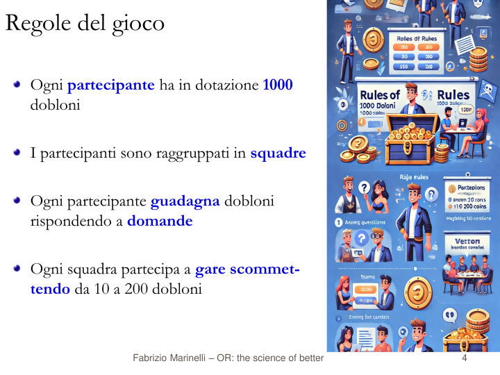

<Frontespizio />

<!--
Buongiorno, sono Gionata Massi e presento l'esperienza didattica "Il Modello tra Problema e Soluzione: Un Percorso tra Competizione e Consapevolezza". Sebbene sia io qui ad illustrare il percorso didattico e la metodologia, questi sono opera del prof. Fabrizio Marinelli, che ho avuto il piacere di coinvolgere in una collaborazione tra l'IIS Savoia Benincasa, scuola in cui insegno, e l'Università Politecnica delle Marche.
Come espresso nel titolo, l'esperienza ha voluto evidenziare il ruolo dell **modello**, un concetto fondamentale per l'informatica che viene spesso trascurato per lasciare spazio all'algoritmo inteso come mera sequenza di azioni. Il sottotitolo vuole indicare come la metodologia utilizzata  si è avvalsa delle tecniche della **gamification**, per favorire il coinvolgimento, e sulla riflessione sul processo cognitivo, per rendere significativa e persistente l'acquisizione delle competenze.
-->

---
layout: itadinfo
hideInToc: true
---

# Piano della Presentazione

<Toc text-sm minDepth="1" maxDepth="2" />

<!--
Vederemo in quale contesto, con quali risorse e quali vincoli, è stata sviluppata l'esperienza didattica; fisseremo gli obiettivi didattici trasversali e specifici; discuteremo della particolare metodologia didattica messa in atto, basata su problemi da risolvere in modo da catturare l'attenzione e stimolare la riflessione; vedremo quali sono i problemi che sono stati presentati, che potere riconoscere tra alcuni classici problemi decisionali; e concluderemo con un'analisi dei risultati ottenuti e dei possibili sviluppi.
-->

---
layout: itadinfo
---

# Contesto

- DM 65/2023
   - Potenziamento delle competenze STEM
   - Linee Guida per le discipline STEM
      - *Utilizzare metodologie attive e collaborative*
      - *Promuovere attività che affrontino questioni e problemi di natura applicativa.*
      - Utilizzare metodologie didattiche per un apprendimento di tipo induttivo.

> [...] promuovere l’integrazione, all’interno dei curricula di tutti i cicli scolastici, di attività, metodologie e contenuti volti a sviluppare le competenze STEM, digitali e di innovazione [...]
>
> **DM n. 65 del 12 aprile 2023**...

- IIS Savoia Benincasa, Ancona
   - IT *Economico*, AFM art. *Sistemi Informativi Aziendali*, Classe *V*
- Università Politecnica delle Marche
   - Prof. Fabrizio Marinelli

<!-- Il percorso didattico è nato quando l'IIS Savoia Benincasa, scuola in cui insegno informatica nell'Istituto Tecnico Economico, ha ricevuto il finanziamento dal DM 65/2025 sul potenziamento delle competenze STEM, Science, Tecnology, Engineering and Mathematics. Mi sono trovato coinvonto nella progettazione e, sebbene nell'acronimo STEM non compaia esplicitamente la Computer Science/Informatics, ho cercato un modo per recuperare la nostra disciplina in un'ottica d'integrazione con le altre.

C'era da progettare un corso con vincoli disciplinari ma anche metodologici, come definito dalle Linee Guida per le discipline STEM. Esse richiedono di *Utilizzare metodologie attive e collaborative* e di *Promuovere attività che affrontino questioni e problemi di natura applicativa.*.

Per inciso e con piacere, faccio notare che le linee guida citano le *Indicazioni Nazionali per l'insegnamento dell’Informatica nella Scuola* proposte dal CINI nel 2017.

La scelta del "gruppo target", presa in collaborazione con i vari dipartimenti della scuola, è stata quella della classe V dell'IT Economico indirizzo AFM art. Sistemi Informativi Aziendali. Le materie oggetto della seconda prova dell'Esame di Stato per questa articolazione avrebbero potuto essere Economia Aziendale oppure Informatica, e al colloquio probabilmente avrebbero avuto un commissario di Matematica Applicata interessato alla Ricerca Operativa. Gli insegnanti di matematica degli Istituti Tecnici sono infatti inquadrati nella Classe di Concorso "A47 - Scienze matematiche applicate". -->

---
layout: itadinfo
---

# Obiettivi

- Trasversali
   - Integrare le competenze in Informatica con quelle di Matematica ed Economia
   - Motivare lo studio verso le discipline STEM
   - Promuovere attività che affrontino problemi e questioni di natura applicativa
- Disciplinari
   - Astrarre le caratteristiche comuni di un problema decisionale
   - Descrivere formalmente un problema decisionale
   - Scoprire come algoritmi diversi risolvono, con uso diverso delle risorse di calcolo, lo stesso problema
   - Scoprire metodi euristici e/o algoritmi esatti per risolvere problemi
   - Definire lo spazio delle soluzioni
   - Valutare l'efficienza degli algoritmi in termini di tempo di calcolo

<!-- Sugli obiettivi specifici ci si è orientati nell'intersezione delle competenze tra Matematica applicata, che coinvolge tutte le lettere di STEM, e l'Informatica, cercando anche un legame con il mondo dell'Economia nella scelta dei contenuti. 
I più caratterizzanti sono quelli relativi alle competenze di astrazione e alla valutazione degli algoritmi in funzione della loro efficacia ed efficienza. -->

---
layout: itadinfo
---

# Metodologia didattica

Una sintesi di:

- *Lezione segmentata*
- *Problem-Based Learning* 
- *Gamification*
- Attenzione ai processi metacognitivi

sviluppata sui problemi decisionali.

<!-- La metodologia didattica sviluppata per questo corso integra elementi ed idee derivate da:
- *lezione segmentata*, per massimizzare efficacia didattica nel rispetto dei tempi attenzione degli studenti;
- *Problem-Based Learning*, adattattato dalle scienze sperimentali a quelle esatte, nelle quali abbiamo risposte oggettivamente verificabili;
- *gamification*, per aumentare il coinvolgimento e la partecipazione attiva degli studenti, e infine,
- uno stimolo costante alla riflessione sul processo di apprendimento, tra continui *active recall*, con frequenti domande e richieste di spiegazione agli studenti, sia tramite un meccanismo di bonus/malus, che abbiamo impropriamente chiamato *scommessa*. -->

---
layout: default
---

## Regole del gioco

   {width=70%, title="Regole del gioco"}

<!-- Il metodo ha usato alcune tecniche della gamification, ed è stato presentato come un gioco in cui ogni partecipante ha una dotazione iniziale di 1000 *dobloni* e guadagna dobloni rispondendo correttamente a domande individuali. I partecipanti collaborano in squadra alla risoluzione di problemi e, insieme al proprio gruppo, possono *scommetterne* da 10 a 200 dobloni sulla qualità della propria soluzione, con la possibilità di incrementare o ridurre la propria dotazione in base all'esito.

Per l'esperienza descritta, sono state formate quattro squadre di quattro studenti ciascuna, con composizione casuale e costante per tutta la durata del corso.

Il sistema di feedback con i nomi degli studenti, i gruppi, il punteggio dei singoli e il punteggio della squadra, dato dal punteggio medio degli studenti della squadra, è stato realizzato con un foglio di calcolo condiviso. -->

---
hideInToc: true
layout: default
---

## Un gioco pieno di problemi!

   {width=65%, title="Fasi didattiche"}

<!-- La progressione didattica, molto approssimativamente, è quella presentata nel diagramma.

Si procede per problemi.

Il problema viene introdotto brevemente, con definizione dei termini e dei concetti di base.

Segue immediatamente una verifica dei concetti appena esposti con la richiesta di attivarsi per ripetere e consolidare la conoscenza, ad esempio tramite quiz.

Il sistema di feedback fornisce il meccanisco per *capire se ho capito*.

Abbiamo favorito poi una discussione aperta a tutta la classe per verificare che tutti gli studenti avessero acquisito i concetti di base.

Il formatore arriva al momento della presentazione della soluzione *naïf*. Un algoritmo che RISOLVE ESATTAMENTE il problema.

Lo studente dovrebbe sentirsi in grado di affrontare un problema reale!

Viene quindi proposto un problema realistico, spesso solo aumentando le dimensioni dell'istanza del problema giocattolo. Gli studenti lavorano in gruppo per un tempo di circa 25/30 minuti, trovano una soluzione e la consegnano.
Aggiungo un dettaglio: l'algoritmo naif non può fornire una soluzione in tempo ragionevole perché lo spazio di ricerca o è' troppo grande oppure ha una rappresentazione che è in dominio continuo, composto da infinite soluzioni non ottime. Il gruppo sperimenta l'intrattabilità computazionale di un problema di cui non conosce un algoritmo risolutivo efficiente.

Dopo la consegna hanno 5/10 minuti per valutare la loro soluzione e scegliere il bonus/malus.

Al termine viene richiesto ad ogni gruppo di dire come hanno risolto il problema e come hanno valutato la loro soluzione. La classifica viene aggiornata ma resta l'incognita dei conoscere quale sia la migliore soluzione possibile. Siamo nello stato del **Problem Not Solved** del *Necessity Learning Design* di Michael Lodi.

E' questo il momento del formatore che illustrare il modello e/o l'algoritmo. Per CERTIFICARE l'ottimalità della soluzione si è fatto ricorso alla programmazione dichiarativa con il linguaggi della Programmazione Lineare e Programmazione Lineare Intera e l'uso di un *risolutore* che ci fornisce la soluzione ottima cercata. 

> Mathematical Programming: Turing completeness and applications to software analysis\
> Leo Liberti, Fabrizio Marinelli \
> [articolo](https://www.lix.polytechnique.fr/~liberti/mpturing.pdf)
>
> Mathematical Programming is Turing complete, and can be used as a general-purpose declarative
language. We present a new constructive proof of this fact, and showcase its usefulness by discussing
an application to finding the hardest input of any given program running on a Minsky Register
Machine. We also discuss an application of Mathematical Programming to software verification
obtained by relaxing one of the properties of Turing complete languages.

-->

---
layout: itadinfo
---

## Successione dei problemi

- Problema dello zaino
- Problema del rettangolo isoperimetrico di area massima
- Problema dello zaino (seconda iterazione)
- Problema del mix ottimo di produzione
- Problema della dieta di costo minimo

<!-- Si presentano alcuni problemi. Ogni problema può essere affrontato con un livello di dettaglio diverso, con un approccio a SPIRALE, come vedremo nel caso del problema dello zaino.
I problemi sono classici problemi di decisione. -->
---
layout: default
---

## Fasi didattiche: il Problema dello Zaino

   {width=70%, title="Introduzione - Problema dello Zaino"}

<!-- L'introduzione del problema avviene in modo semplice, con riferimente al quotidiano o a esperienze più o meno familiari. Qui vedete un esempio. Non ho ancora formalismi. -->

---
layout: default
---

### Problema dello Zaino - Sfida individuale

   {width=70%, title="Sfida individuale - Problema dello Zaino"}

<!-- Per rendere attivo la lezione si usano tecniche di *active recall* inserite nel contesto della gamification. Nell'esperienza è stato usato *WooClap* per gestire le risposte. Vedrete il logo di WooClap in molte slide,  -->

---
layout: default
---

### Problema dello Zaino - Soluzione naïf

   {width=70%, title="Soluzione naïf - 1 - Problema dello Zaino"}

<!-- Questo è il momento dell'algoritmo di risoluzione esatta che risolve il problema giocattolo ma non risolve il problema reale. Gli studenti però questo ancora non lo sanno, o almeno non lo sanno per il primo problema presentato. Nel caso specifico del problema dello zaino, però, la soluzione naif è stata posticipata dopo aver visto un altro problema-->

---
layout: default
---

### Problema dello Zaino - Spazio delle soluzioni

   {width=70%, title="Soluzione naïf - 2 - Problema dello Zaino"}

<!-- Questa è l'illustrazione del spazio delle soluzioni.
La slide è stata usata anche riattivare gli schemi cognitivi realativi a:

- tipo boolean
- array di boolean
- codifica binaria
- numero di configurazioni distinte di $n$ cifre binarie
 -->

---
layout: default
---

### Problema dello Zaino - Sfida di gruppo

   {width=70%, title="Sfida di gruppo - Problema dello Zaino"}

<!-- Questa è la sfida di gruppo, che nella progressione reale dell'esperienza era stata proposta prima della soluzione naif.
Il QR code permetteva di scaricare i dati dei 50 oggetti in un foglio di calcolo. -->

---
layout: default
---

### Problema dello Zaino - Discussione

   {width=70%, title="Discussione - Problema dello Zaino"}

<!-- E' stato un problema utile ai fini didattici?
Sì! Ha portato alla scoperta delle euristiche, in questo caso degli ALGORITMI GOLOSI.
Sono emerse strategie risolutive, euristiche appunto!, per cui gli studenti tutti hanno applicato criteri di ordinamento dei dati, per profitto, per peso e per il rapporto tra profitto e peso.
Non conoscono concetti avanzati come *regole di dominanza* e *oggetti dominati*, *limitanti*, *algoritmi esatti*... 
-->

---
layout: default
---

### Problema dello Zaino - Verso il modello

   {width=70%, title="Spiegazione - Problema dello Zaino"}

<!-- Dopo circa 6 ore e, dopo anche una simulazione dell'enumerazione totale delle $2^50$ soluzioni che gira per ore prima di essere interrotta, si arriva al momento di costruire il modello per risolvere il problema. E' un processo complesso che la prima volta è molto guidato. -->

---
layout: default
---

### Problema dello Zaino - Il modello

   {width=70%, title="Spiegazione - Problema dello Zaino"}

<!-- Alla fine si giunge alla formulazione secondo il modello della Programmazione Lineare Intera.

Il logo che si vede in basso è quello di CoLab.

Con CoLab viene tradotto il modello matematico usando il linguaggio AMPL e viene risolto il problema.

La soluzione ottima vale 196. Il miglior valore trovato dagli studenti con l'euristica golosa basata sulla densità.
-->

---
layout: itadinfo
---

### Problema dello zaino - Concetti chiave

- Astrazione
- Rappresentazione
   - del problema -> MODELLO
   - codifica dell'istanza
   - codifica e spazio delle soluzioni
- Algoritmi
   - esatti (enumerazione totale)
   - euristici (greedy)
   - complessità temporale: crescita esponenziale
- Linguaggi
   - Programmazione Lineare Intera (PLI)
   - A Mathematical Programming Language (AMPL)

<!-- Cosa hanno imparato. Tutto quello che leggete nella diapositiva! -->

---
layout: itadinfo
---

# Conclusioni...

- Didattica disciplinare
   - Dal problema alla soluzione tramite la costruzione del Modello
   - Risoluzione di problemi reali
- Metodologia didattica
   - Attiva, efficace e motivante
   - Attivazione processi metacognitivi
- Estendibilità ad altri ambiti
   - programmazione
   - basi di dati
   - ingegneria del software

<!--
Gli studenti hanno:
- consolidato schemi propri dei concetti informatici,
- scoperto come i problemi possano essere formulati secondo modelli
- problemi concreti simili possono essere istanze di uno stesso modello
- scoperto l'intrattabilità computazionale

A livello di metodologia didattico:
- buona percezione da parte degli studenti di aver appreso nuovi concetti
- senso di utilità delle competenze apprese
- crediamo di aver stimolato l'apprendimento in modo attivo e significativo

Il modello didattico ci sembra facilmente replicabile in altri ambiti.
- didattica dei linguaggi di programmazione, nella quale procedere con problemi che aggiungono pattern strutturali comuni
- nello sviluppo di modelli di dati, pensando alle ristrutturazioni del modello concettuale in logico, oppure la storicizzazione dei dati
- in ingegneria del software, dove i problemi potrebbero essere quelli categorizzati nei "Design Patterns"
-->

---
hideInToc: true
layout: default
---

<RetroFrontespizio />

---
hideInToc: true
layout: itadinfo
---

### ...e sviluppi futuri

- Revisione delle tecniche di gamification e versione online del sistema di gamification
- Repliche del corso, anche in altri indirizzi, esteso a  problemi formulati su grafi
- Monitoraggio dell'efficacia didattica con raccolta di dati per analisi e miglioramenti

<!--  -->

---
layout: itadinfo
---

### Problema dello Zaino - Discussione - 2

   {width=70%, title="Discussione - Problema dello Zaino"}

---
layout: itadinfo
---

### Problema dello Zaino - Spiegazione e MODELLO - 1

   {width=70%, title="Spiegazione - Problema dello Zaino"}

---
layout: itadinfo
---

### Problema dello Zaino - Spiegazione e MODELLO - 3

   {width=70%, title="Spiegazione - Problema dello Zaino"}

---
layout: itadinfo
---

### Problema dello Zaino - Spiegazione e MODELLO - 4

   {width=70%, title="Spiegazione - Problema dello Zaino"}

---
layout: itadinfo
---

### Problema dello Zaino - Spiegazione e MODELLO - 5

   {width=70%, title="Spiegazione - Problema dello Zaino"}

---
layout: itadinfo
---

### Problema dello Zaino - Spiegazione e MODELLO - 6

   {width=70%, title="Spiegazione - Problema dello Zaino"}

---
layout: itadinfo
---

## Rettangolo isoperimetrico

   {width=70%, title="Introduzione - Rettangolo isoperimetrico"}

---
layout: itadinfo
---

### Rettangolo isoperimetrico - Concetti chiave

- Astrazione
- Rappresentazione
   - del problema -> MODELLO
   - discretizzazione spazio delle soluzioni
   - codifica dell'istanza discretizzata 
   - codifica delle soluzioni e simmetria
- Algoritmi
   - simulazione: iterazione con ricerca del massimo
   - soluzione algebrica (cond. primo e secondo ordine derivate)
- Linguaggi
   - A Mathematical Programming Language (AMPL)

---
layout: itadinfo
---

## Mix ottimo di produzione

   {width=70%, title="Introduzione - Mix ottimo"}

---
layout: itadinfo
---

## Problema della dieta

   {width=70%, title="Introduzione - Problema della dieta"}

---
layout: itadinfo
---

### Problema della dieta - Concetti chiave

- Astrazione
- Rappresentazione
   - del problema -> MODELLO
- Algoritmi
   - algoritmi greedy
   - cenni al metodo del simplesso
- Linguaggi
   - A Mathematical Programming Language (AMPL)
